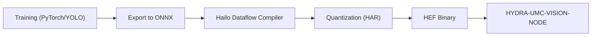

<p align="center">
  
</p>

# 🎯 HYDRA-UMC-DETECTION-HEF

<p align="center">🇺🇸 <b>English</b> | <a href="README_spa.md">🇪🇸 Español</a> | <a href="README_fra.md">🇫🇷 Français</a> | <a href="README_ita.md">🇮🇹 Italiano</a> | <a href="README_deu.md">🇩🇪 Deutsch</a> | <a href="README_zho.md">🇨🇳 简体中文</a> | <a href="README_jpn.md">🇯🇵 日本語</a></p>

### 📦 Hardware-Accelerated Industrial Model Library (Hailo-8 / Hailo-10)

<p align="left">
  
  
  
  
</p>

---

## 1. 🛠️ TECHNICAL OVERVIEW

**HYDRA-UMC-DETECTION-HEF** is intended to be a curated library and toolchain for high-performance neural network models compiled to the **Hailo Executable Format (HEF)**, tuned for industrial micro-factory environments: electronics assembly, SMD placement, and tool head validation.

This is one of the 4 children of **[HYDRA-UMC-VISION-NODE](https://github.com/JuanenRac/HYDRA-UMC-VISION-NODE)**, the family's integration parent: this project owns model compilation and versioning only - the served, running copy of a `.hef` model is loaded and executed by the parent, which owns the Hailo-8 device handle, not by this project itself.

### Key Points

* ✅ **Real v0 - model registry:** `registry.py` parses and schema-validates a JSON registry of compiled models, detects duplicate name+version entries, finds the latest version for a name/task, and sha256-checksums local `.hef` files against it. Exposed via `registry validate`/`registry latest` below - no Hailo SDK or hardware needed to run or test it.
* 🔒 **Real v0 - safe-load gate:** `compatibility.py`'s `safe_load()` checks real Hailo-architecture compatibility (`hailo8`/`hailo15h`/etc. - every registry entry now declares its target chip) before verifying the checksum, and never reports a model ready to deploy unless both real checks pass. Exposed via `registry load` below.
* 🌐 **Real v0 - JSON/HTTP API:** `api.py`'s `serve` subcommand runs the exact same registry/safe-load checks as a long-running local service (default `127.0.0.1:8093`) via `GET /registry`, `GET /registry/latest`, `GET /registry/load`, and `GET /stats` - the registry and models directory are configured once at startup, not per request. See [`docs/CLI_REFERENCE.md`](docs/CLI_REFERENCE.md) for real captured examples of every endpoint.
* 🛠️ **Industrial Detection (planned):** models targeting PCB components, solder joints, and mechanical defects.
* 📐 **Fiducial Alignment (planned):** high-precision anchors for Pick-and-Place synchronization.
* ⚡ **Quantized Performance (planned):** INT8/INT4 variants targeting the Hailo-8/Hailo-10 NPUs for sub-10ms inference. *(future work - needs the real Hailo-8/Hailo-10 NPU and Dataflow Compiler this environment doesn't have.)*
* 🤖 **Pose Estimation (planned):** keypoint detection for robotic arm joint tracking. *(future work, same reason.)*
* 🧩 **Why it exists as its own project:** compiling and versioning models is a data/ML workflow, entirely different from the runtime process that serves them - keeping the toolchain here means a bad compile never risks the running perception node, and models can be iterated on and validated offline before ever reaching [HYDRA-UMC-VISION-NODE](https://github.com/JuanenRac/HYDRA-UMC-VISION-NODE).

**Honesty check - what actually runs today:** the real, hardware-independent half of this project's job - the model registry (`registry.py`) and the real safe-load gate (`compatibility.py`), exposed via `registry validate`/`registry latest`/`registry load` and, as a long-running JSON/HTTP API, via `serve` (`api.py`) - is implemented and tested (48 tests). The ONNX export, Hailo Dataflow Compiler quantization, and HAR/HEF packaging steps that would actually *produce* the models this registry describes are still future work: they need real Hailo hardware this environment doesn't have. See [`CHANGELOG.md`](CHANGELOG.md) for exactly what has shipped so far, and "Current Status & Next Steps" below for what remains open.

---

## 2. 🔄 INTENDED MODEL COMPILATION FLOW

The diagram below is the target *compilation* toolchain this project is being built towards - still not implemented, since every step needs real Hailo hardware. The model *registry* (versioning + integrity checking of whatever `.hef` files this pipeline eventually produces) is real today; see "Key Points" above and the design decisions below.



---

## 3. 🧠 ADVANCED TECHNICAL INFORMATION

### Why no `hardware/`/`firmware/` here, and why `os/`/`models/` still live in the parent

This project ships model files and the tooling that compiles them, not a physical device - so, like the rest of the Vision AI Node family, it carries no `hardware/`/`firmware/` folder. It does not carry `os/` or `models/` either, even though `.hef` files are literally *produced* here: the *served, running* copy loaded onto the Hailo-8 NPU at runtime lives only in the integration parent, [HYDRA-UMC-VISION-NODE](https://github.com/JuanenRac/HYDRA-UMC-VISION-NODE), because that is the process that owns the Hailo-8 device handle. This project's own `build/` is where compiled toolchain output is meant to land before being published there.

### The compilation flow is the design decision, ahead of the code

The diagram above already fixes the intended pipeline shape: PyTorch/YOLO training happens elsewhere (out of scope for this repository), models are exported to ONNX, run through the Hailo Dataflow Compiler for INT8/INT4 quantization (producing a `.har`), and finally packaged as a `.hef` binary that [HYDRA-UMC-VISION-NODE](https://github.com/JuanenRac/HYDRA-UMC-VISION-NODE) consumes. Deciding and documenting this shape now, before writing the toolchain code, keeps the eventual implementation from having to improvise the model registry/versioning story later.

### Design decisions already made

* **Version read from installed package metadata, not hardcoded** - `main.py` calls `importlib.metadata.version("hydra-umc-detection-hef")` instead of a second `__version__` string, so `bump_version.py` only ever has one place to edit.
* **The odometer bump only ever touches `PATCH`/`MINOR` automatically** - `bump_version.py` carries `PATCH` into `MINOR` past 9 and `MINOR` into `MAJOR` past 9, but never bumps `MAJOR` itself; same convention as `HYDRA-UMC-EDITOR-URDF/bump_version.py` and `HYDRA-UMC-SUITE/bump_version.py`.
* **A missing local `.hef` file is not a checksum failure** - `verify_checksum()` returns `None` (not `False`) when the file the registry describes isn't present under `--models-dir`, and `registry validate` reports it as "skipped", not an error. The registry is expected to describe models that may live in a separate object store, not necessarily checked into this repo - only a checksum that actually mismatches for a file that *is* present indicates a corrupt registry.
* **Why `safe_load()` checks architecture before checksum, not the other way around.** Architecture compatibility is pure metadata (no I/O); checksum verification needs to read a real file. Checking the cheap, fundamental gate first means a model compiled for the wrong Hailo chip is rejected before the filesystem is ever touched, and the rejection reason names the most fundamental failing check rather than a misleading "file missing" for a model that was never going to run on this hardware anyway.
* **Why architecture compatibility is exact-match, not a compatibility matrix.** The Hailo Dataflow Compiler bakes the target chip into a `.hef` at compile time - claiming e.g. a Hailo-15H can run a Hailo-8 `.hef` would need real cross-architecture validation on real hardware this environment doesn't have. Exact match is the only compatibility claim honestly verifiable from registry metadata alone.

---

## 📂 DIRECTORY STRUCTURE

```text
HYDRA-UMC-DETECTION-HEF/
├── src/                 # Source code (hydra_umc_detection_hef package)
│   └── hydra_umc_detection_hef/
│       ├── registry.py       # Model registry: schema validation, versioning, sha256 checks
│       ├── compatibility.py  # Real safe-load gate: arch compatibility + checksum, combined
│       ├── api.py            # Plain JSON/HTTP surface (stdlib http.server) over the model registry
│       └── main.py           # CLI entry point (bare invocation + `registry` + `serve`)
├── tests/               # Real pytest suite (registry, compatibility, api, CLI)
├── docs/
│   └── CLI_REFERENCE.md # Full CLI + JSON/HTTP API reference, every example captured from a real run
├── build/               # Build output (local .venv + future HEF toolchain output)
├── images/              # Media and diagrams
├── systemd/
│   └── hydra-umc-detection-hef.service # Local CM5 model-registry API systemd unit
├── tools/
│   ├── build_test.py    # Non-versioning build/compile check (no version/CHANGELOG bump)
│   └── ci_validate.py   # Manifest/CHANGELOG/docs validation used by CI
├── pyproject.toml       # Package metadata, dependencies, odometer version
├── bump_version.py      # Odometer-style native version bump (run by build.sh/.bat)
├── bump_manifest_version.py # Syncs hydra-umc.project.json's version to the native one (--sync)
├── build.sh / build.bat # venv + editable install + compile-check + tests
├── run.sh / run.bat     # Runs the entry point from the local venv
└── CHANGELOG.md         # Version-by-version history (odometer scheme, no dates)
```

No `hardware/`, `firmware/`, `os/` or `models/` folder - see "Advanced Technical Information" above for why. `os/` and `models/` live only in the integration parent, [HYDRA-UMC-VISION-NODE](https://github.com/JuanenRac/HYDRA-UMC-VISION-NODE); this project's own `build/` is where its HEF toolchain output is meant to land until it is published there.

---

## 🏗️ BUILD & RUN GUIDE

### Prerequisites

* **Python 3.10 or newer** on your `PATH` (the scripts try `python3` then fall back to `python`).
* No ONNX/Hailo Dataflow Compiler tooling is required yet - **zero third-party runtime dependencies** at this stage (`dependencies = []` in `pyproject.toml`).
* A few tens of MB of disk space for a local virtual environment under `.venv/`.

### Step by step

```bash
# Linux / macOS
./build.sh
```

1. **Odometer version bump** - runs `bump_version.py`, incrementing `PATCH` in `pyproject.toml` on every build (carrying into `MINOR`/`MAJOR` per the rule above).
2. **Virtual environment** - creates `.venv/` if missing; reuses it otherwise.
3. **Editable install** - `pip install -e ".[dev]"` so `src/` edits take effect immediately, installs `pytest`, and registers the `hydra-umc-detection-hef` console entry point.
4. **Compile-check** - `python -m compileall -q src` byte-compiles every file under `src/`, catching syntax errors ecosystem-wide.
5. **Real test suite** - `python -m pytest tests/ -q` (48 tests covering the registry, the safe-load gate, and the CLI).

`set -euo pipefail` stops the script at the first failing step; the build only reports success if all 5 pass.

```bash
./run.sh
```

Locates the interpreter inside `.venv` (handling both the POSIX and Windows `.venv` layouts) and runs `python -m hydra_umc_detection_hef.main`, forwarding any arguments through - bare invocation prints name + version + role.

Real example - validate a registry and look up the latest version of a model:

```bash
./run.sh registry validate --registry registry.json --models-dir models/
# 2 entries in registry.json
#   pcb-defect 0.1.0: pcb-defect-0.1.0.hef not present locally, skipped
#   pcb-defect 0.2.0: checksum OK
# registry OK

./run.sh registry latest --registry registry.json --name pcb-defect
# pcb-defect 0.2.0  task=detection  input_shape=(640, 640, 3)
# classes: solder_bridge, missing_component
# hef_path: pcb-defect-0.2.0.hef
# sha256: 1c8a52bb4a34927d55efc913b23f06bd08ff5eeee0aca2ccd8d2c0fd34c81497
```

Each registry entry also declares its target `hailo_arch` (e.g. `hailo8`). The real `registry load` subcommand combines the checksum check above with a real architecture-compatibility check, and only ever reports a model ready if both pass:

```bash
./run.sh registry load --registry registry.json --models-dir models/ --name pcb-defect --target-arch hailo8
# READY: pcb-defect 0.2.0 (hailo8) verified and ready

./run.sh registry load --registry registry.json --models-dir models/ --name pcb-defect --target-arch hailo15h
# REJECTED_ARCH_MISMATCH: model compiled for 'hailo8', this deployment targets 'hailo15h'
```

The same registry/safe-load checks are also reachable as a long-running JSON/HTTP API via `./run.sh serve --registry registry.json --models-dir models/` (default `127.0.0.1:8093`). See [`docs/CLI_REFERENCE.md`](docs/CLI_REFERENCE.md) for the full command and endpoint reference, with every example captured from a real run.

```bat
:: Windows - identical steps, batch syntax
build.bat
run.bat
```

### Troubleshooting

* **`python`/`python3` not found** - install Python 3.10+ and ensure it is on `PATH`.
* **`compileall` fails** - a real syntax error was introduced under `src/`; the build stops without touching the install, on purpose.
* **"No `.venv` found" from `run.sh`/`run.bat`** - run `build.sh`/`build.bat` at least once first.
* **Stale editable install** - delete `.venv/` and rebuild; rarely needed.

---

## 🚀 Current Status & Next Steps

**What works today:** the model registry - schema validation (including required, validated Hailo-architecture metadata), duplicate-version detection, latest-version lookup, and sha256 integrity checking (`registry.py`) - plus a real, combined safe-load gate that checks architecture compatibility and checksum integrity together and never reports a model ready unless both pass (`compatibility.py`), the same checks exposed as a real long-running JSON/HTTP API (`api.py`, `serve` subcommand) alongside the one-shot CLI, 48 tests total, and a real, installable Python package with a verified entry point and an odometer-style version bump wired into the build. See [`CHANGELOG.md`](CHANGELOG.md) for the captured build/run output.

**What is still open, in no particular order and with no committed timeline, and blocked on real Hailo hardware:**

* The real ONNX export step from trained PyTorch/YOLO models.
* Hailo Dataflow Compiler integration for INT8/INT4 quantization.
* HAR/HEF packaging that would actually populate a registry file this project's `registry.py` already knows how to read and validate.
* Publishing compiled `.hef` output into [HYDRA-UMC-VISION-NODE](https://github.com/JuanenRac/HYDRA-UMC-VISION-NODE)'s `models/` folder.

---

## 🔗 Related Projects

This project is part of the HYDRA-UMC robotics ecosystem by the same author (JuanenRac / Electro Hobby 3D). Worth knowing about, since a request might actually be about one of these rather than this repository.

**Parent Project**
- **[HYDRA-UMC-VISION-NODE](https://github.com/JuanenRac/HYDRA-UMC-VISION-NODE)** — integration hub for the Hailo-8 vision pipeline, with a real per-stage hardware-readiness check; the parent this repo is one specific stage or consumer of, within its own perception pipeline.

**Sibling Projects** — the other stages/consumers of HYDRA-UMC-VISION-NODE's own Hailo-8 perception pipeline
- **[HYDRA-UMC-VISION-STREAMER](https://github.com/JuanenRac/HYDRA-UMC-VISION-STREAMER)** — real GStreamer pipeline + MediaMTX config generator with a real HailoRT integration boundary.
- **[HYDRA-UMC-SAFETY-ZONES](https://github.com/JuanenRac/HYDRA-UMC-SAFETY-ZONES)** — real zone-breach checking and E-STOP requesting, with calibration-freshness enforcement.
- **[HYDRA-UMC-VISUAL-SERVOING-API](https://github.com/JuanenRac/HYDRA-UMC-VISUAL-SERVOING-API)** — real Position-Based Visual Servoing correction law, safety-gated on upstream zone state.

**Directly Related**
- **[URTC](https://github.com/JuanenRac/URTC)** — firmware for the physical Universal Robot Tool Controller PCB, 25+ tool profiles over CAN bus; visual recognition of URTC's own tool heads relies on models compiled here.

**Also Part of the Ecosystem**

*Core Hardware & Platform*
- **[HYDRA-UMC](https://github.com/JuanenRac/HYDRA-UMC)** — the physical robot-arm motherboard: CM5 host + dual-core STM32H745, orchestrating up to 8 tool arms over CAN-OTA/SPI-OTA.
- **[HYDRA-UMC-OS](https://github.com/JuanenRac/HYDRA-UMC-OS)** — reproducible Raspberry Pi OS product layer for the CM5: read-only agent, validated config/profiles, WiFi first-contact provisioning.
- **[HYDRA-UMC-SDK](https://github.com/JuanenRac/HYDRA-UMC-SDK)** — the shared JSON-Schema contract and safety-gate boundary every bridge validates its commands against.

*Core Backend & Clients*
- **[HYDRA-UMC-SERVER](https://github.com/JuanenRac/HYDRA-UMC-SERVER)** — the real headless backend (REST/WebSocket) every control client actually talks to.
- **[HYDRA-UMC-STUDIO](https://github.com/JuanenRac/HYDRA-UMC-STUDIO)** — web control dashboard with real-time multi-robot 3D visualization.
- **[HYDRA-UMC-SUITE](https://github.com/JuanenRac/HYDRA-UMC-SUITE)** — desktop (PySide6) swarm command center for multiple servers at once, packaged as a standalone executable.
- **[HYDRA-UMC-ANDROID-CONTROL](https://github.com/JuanenRac/HYDRA-UMC-ANDROID-CONTROL)** — native Android control app with biometric login and a paired Wear OS companion.
- **[HYDRA-UMC-IOS-CONTROL](https://github.com/JuanenRac/HYDRA-UMC-IOS-CONTROL)** — iOS/iPadOS control app (Flutter) with real-time WebSocket sync.
- **[HYDRA-UMC-DSI](https://github.com/JuanenRac/HYDRA-UMC-DSI)** — native touch UI for the onboard 7" DSI touchscreen, embedded on the CM5 itself.
- **[HYDRA-UMC-EDITOR-URDF](https://github.com/JuanenRac/HYDRA-UMC-EDITOR-URDF)** — desktop graphical URDF creator/editor that pushes finished models into STUDIO's own catalog.
- **[HYDRA-UMC-BRIDGE-AMR](https://github.com/JuanenRac/HYDRA-UMC-BRIDGE-AMR)** — coordination boundary for AGV/AMR fleets via a real VDA 5050 MQTT publisher.
- **[HYDRA-UMC-BRIDGE-CNC](https://github.com/JuanenRac/HYDRA-UMC-BRIDGE-CNC)** — high-level CNC-cell coordinator with real GRBL status/control-byte access.
- **[HYDRA-UMC-BRIDGE-DROIDS](https://github.com/JuanenRac/HYDRA-UMC-BRIDGE-DROIDS)** — coordination boundary for legged/humanoid droids, with a real Boston Dynamics Spot command sender.
- **[HYDRA-UMC-BRIDGE-LASER](https://github.com/JuanenRac/HYDRA-UMC-BRIDGE-LASER)** — laser-cell safety coordinator reading 3 real key/enclosure/interlock GPIO safeguards.
- **[HYDRA-UMC-BRIDGE-OPENPNP](https://github.com/JuanenRac/HYDRA-UMC-BRIDGE-OPENPNP)** — safe high-level board-flow coordinator for OpenPnP pick-and-place.
- **[HYDRA-UMC-BRIDGE-PRINTER3D](https://github.com/JuanenRac/HYDRA-UMC-BRIDGE-PRINTER3D)** — safe coordination boundary for Moonraker/Klipper 3D printers, with real gated job commands.
- **[HYDRA-UMC-BRIDGE-ROS2](https://github.com/JuanenRac/HYDRA-UMC-BRIDGE-ROS2)** — safety coordinator with a real, lazily-imported rclpy ROS 2 transport.
- **[HYDRA-UMC-BRIDGE-UAV](https://github.com/JuanenRac/HYDRA-UMC-BRIDGE-UAV)** — coordination boundary for camera-equipped UAVs, with a real MAVLink command sender.

*URTC Tool Platform*
- **[URTC-FLASHER](https://github.com/JuanenRac/URTC-FLASHER)** — desktop GUI flashing tool for URTC boards, CAN-OTA plus full-chip SWD/JTAG.
- **[URTC-TESTER](https://github.com/JuanenRac/URTC-TESTER)** — desktop live CAN-bus diagnostic tool for URTC boards, one panel per tool profile.
- **[URTC-WEB-STUDIO](https://github.com/JuanenRac/URTC-WEB-STUDIO)** — browser-based alternative to URTC-TESTER via the Web Serial API, no local install needed.

*Cognitive AI Node (Hailo-10)*
- **[HYDRA-UMC-COGNITIVE-NODE](https://github.com/JuanenRac/HYDRA-UMC-COGNITIVE-NODE)** — integration hub for the Hailo-10 cognitive pipeline (LLM/VLA/voice orchestration).
- **[HYDRA-UMC-VLA-ENGINE](https://github.com/JuanenRac/HYDRA-UMC-VLA-ENGINE)** — real action-token encoding/decoding and trajectory generation for a Vision-Language-Action model.
- **[HYDRA-UMC-VOICE-UI](https://github.com/JuanenRac/HYDRA-UMC-VOICE-UI)** — real voice front-end (VAD + intent parser) with a bounded, confirmation-gated Watch relay.
- **[HYDRA-UMC-SEMANTIC-PLANNER](https://github.com/JuanenRac/HYDRA-UMC-SEMANTIC-PLANNER)** — real rule-based task decomposition and semantic error recovery over MCU error codes.
- **[HYDRA-UMC-DOCS-QA](https://github.com/JuanenRac/HYDRA-UMC-DOCS-QA)** — real stdlib-only TF-IDF document search over this ecosystem's own Markdown docs.

*Orchestration & Swarm*
- **[HYDRA-UMC-ORCHESTRATOR](https://github.com/JuanenRac/HYDRA-UMC-ORCHESTRATOR)** — integration hub with a real gRPC/Protobuf health-report contract and mission state machine.
- **[HYDRA-UMC-JOB-DISPATCHER](https://github.com/JuanenRac/HYDRA-UMC-JOB-DISPATCHER)** — real priority-based job queue with deduplication, over a real HTTP API.
- **[HYDRA-UMC-NODE-HEALING](https://github.com/JuanenRac/HYDRA-UMC-NODE-HEALING)** — real gRPC-based fleet health watchdog with retry/backoff and identity-mismatch detection.
- **[HYDRA-UMC-PATH-PLANNER-3D](https://github.com/JuanenRac/HYDRA-UMC-PATH-PLANNER-3D)** — real RRT-based 3D path planner with real obstacle/workspace collision validation.
- **[HYDRA-UMC-SWARM-SYNC](https://github.com/JuanenRac/HYDRA-UMC-SWARM-SYNC)** — real CRDT LWW-Element-Map state sync, property-tested for multi-cell convergence.

*Digital Twin & Simulation*
- **[HYDRA-UMC-TWIN](https://github.com/JuanenRac/HYDRA-UMC-TWIN)** — integration hub for the digital-twin engine, with a real version-compatibility sync contract.
- **[HYDRA-UMC-HIL-BRIDGE](https://github.com/JuanenRac/HYDRA-UMC-HIL-BRIDGE)** — real hardware-in-the-loop safety interlock routing commands between simulation and real hardware.
- **[HYDRA-UMC-PHYSICS-REPLICA](https://github.com/JuanenRac/HYDRA-UMC-PHYSICS-REPLICA)** — real forward kinematics and joint-limit validation over a real URDF subset.
- **[HYDRA-UMC-SYNTHETIC-DATA-GEN](https://github.com/JuanenRac/HYDRA-UMC-SYNTHETIC-DATA-GEN)** — real procedural 2D scene generator with YOLO/COCO annotation export.

*Data & Analytics*
- **[HYDRA-UMC-DATALAKE](https://github.com/JuanenRac/HYDRA-UMC-DATALAKE)** — real sqlite3-backed time-series store with a real ingest/query HTTP API.
- **[HYDRA-UMC-ANOMALY-DETECTOR](https://github.com/JuanenRac/HYDRA-UMC-ANOMALY-DETECTOR)** — real FFT + statistical baseline anomaly detector with drift monitoring.
- **[HYDRA-UMC-PRODUCTION-REPORTS](https://github.com/JuanenRac/HYDRA-UMC-PRODUCTION-REPORTS)** — real OEE/availability calculation over DATALAKE history, with reproducible CSV export.
- **[HYDRA-UMC-TELEMETRY-COLLECTOR](https://github.com/JuanenRac/HYDRA-UMC-TELEMETRY-COLLECTOR)** — real CAN/WebSocket ingestion pipeline into DATALAKE, with sequence deduplication.

*Industrial Gateway*
- **[HYDRA-UMC-GATEWAY-INDUSTRIAL](https://github.com/JuanenRac/HYDRA-UMC-GATEWAY-INDUSTRIAL)** — integration hub relaying to industrial protocols, with a real command allowlist/backpressure layer.
- **[HYDRA-UMC-OPCUA-SERVER](https://github.com/JuanenRac/HYDRA-UMC-OPCUA-SERVER)** — real OPC-UA address space, verified with a real binary-protocol client session.
- **[HYDRA-UMC-MQTT-BROKER](https://github.com/JuanenRac/HYDRA-UMC-MQTT-BROKER)** — real MQTT broker with optional per-client authentication and topic ACLs.
- **[HYDRA-UMC-MTCONNECT-ADAPTER](https://github.com/JuanenRac/HYDRA-UMC-MTCONNECT-ADAPTER)** — real MTConnect `/probe` and `/current` XML endpoints with degraded-mode output.

*Complementary Tools & Ecosystem Operations*
- **[HYDRA-UMC-DASHBOARD-AI](https://github.com/JuanenRac/HYDRA-UMC-DASHBOARD-AI)** — Smart Summaries and Anomaly Highlighting panels over DATALAKE/ANOMALY-DETECTOR, with an honest statistical fallback.
- **[HYDRA-UMC-TOOL-CLI](https://github.com/JuanenRac/HYDRA-UMC-TOOL-CLI)** — fleet CLI with a real, stable exit-code contract, a genuine live client of HYDRA-UMC-SERVER's own API.
- **[HYDRA-UMC-WATCH](https://github.com/JuanenRac/HYDRA-UMC-WATCH)** — WearOS companion app with real haptic alerts and a paired-phone voice relay.
- **[URTC-SMART-RACK](https://github.com/JuanenRac/URTC-SMART-RACK)** — firmware for a board-mounting rack with real tool-ID decoding and Smart Idle pre-heating logic.
- **[URTC-VISION-TOOL](https://github.com/JuanenRac/URTC-VISION-TOOL)** — firmware plus a real Python vision companion for a thermal/RGB inspection tool head.
- **[HYDRA-UMC-UPDATER](https://github.com/JuanenRac/HYDRA-UMC-UPDATER)** — administrative desktop tool that discovers, clones and updates every repo in this ecosystem.

---

## 📚 Documentation & Community

- **[CONTRIBUTING.md](CONTRIBUTING.md)** — tech stack and coding guidelines for a pull request.
- **[CODE_OF_CONDUCT.md](CODE_OF_CONDUCT.md)** — the standards of behavior expected in this community.
- **[SECURITY.md](SECURITY.md)** — how to report a vulnerability, and this project's own real security focus areas.
- **[SUPPORT.md](SUPPORT.md)** — where to ask questions and report bugs.
- **[LICENSE.md](LICENSE.md)** — this project's own license.

## 👤 AUTHOR
**JuanenRac** (Electro Hobby 3D)
📧 electrohobby3d@gmail.com
📺 [youtube.com/@electrohobby3d](https://youtube.com/@electrohobby3d)

## 📜 LICENSE
GPL-3.0 - See LICENSE for details.
