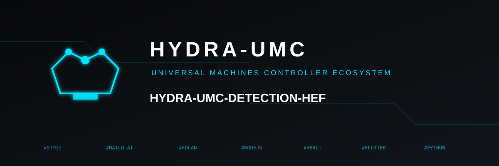

<p align="center">
  
</p>

# 🎯 HYDRA-UMC-DETECTION-HEF

<p align="center"><a href="README.md">🇺🇸 English</a> | 🇪🇸 <b>Español</b> | <a href="README_fra.md">🇫🇷 Français</a> | <a href="README_ita.md">🇮🇹 Italiano</a> | <a href="README_deu.md">🇩🇪 Deutsch</a> | <a href="README_zho.md">🇨🇳 简体中文</a> | <a href="README_jpn.md">🇯🇵 日本語</a></p>

### 📦 Librería Industrial de Modelos Acelerados por Hardware (Hailo-8 / Hailo-10)

<p align="left">
  
  
  
  
</p>

---

## 1. 🛠️ VISIÓN GENERAL TÉCNICA

**HYDRA-UMC-DETECTION-HEF** está pensado para ser una librería y toolchain curada de modelos de red neuronal de alto rendimiento compilados al **Hailo Executable Format (HEF)**, ajustados para entornos de micro-fábrica industrial: ensamblaje de electrónica, colocación SMD y validación de cabezales de herramienta.

Este es uno de los 4 hijos de **[HYDRA-UMC-VISION-NODE](https://github.com/JuanenRac/HYDRA-UMC-VISION-NODE)**, el padre de integración de la familia: este proyecto solo posee la compilación y versionado de modelos - la copia servida en ejecución de un modelo `.hef` la carga y ejecuta el padre, que posee el handle del dispositivo Hailo-8, no este proyecto.

### Puntos Clave

* ✅ **Real v0 - registro de modelos:** `registry.py` parsea y valida por esquema un registro JSON de modelos compilados, detecta entradas duplicadas nombre+versión, encuentra la última versión para un nombre/tarea, y verifica archivos `.hef` locales por checksum sha256 contra el registro. Expuesto vía `registry validate`/`registry latest` más abajo - no hace falta el SDK de Hailo ni hardware para ejecutarlo ni testearlo.
* 🔒 **Real v0 - verja de carga segura:** `safe_load()` de `compatibility.py` comprueba la compatibilidad real de arquitectura Hailo (`hailo8`/`hailo15h`/etc. - cada entrada del registro ahora declara su chip objetivo) antes de verificar el checksum, y nunca reporta un modelo listo para desplegar a menos que ambas comprobaciones reales pasen. Expuesto vía `registry load` más abajo.
* 🛠️ **Detección Industrial (previsto):** modelos orientados a componentes de PCB, soldaduras y defectos mecánicos.
* 📐 **Alineación de Fiduciales (previsto):** anclas de alta precisión para sincronización Pick-and-Place.
* ⚡ **Rendimiento Cuantizado (previsto):** variantes INT8/INT4 orientadas a las NPU Hailo-8/Hailo-10 para inferencia sub-10ms. *(trabajo futuro - necesita la NPU Hailo-8/Hailo-10 real y el Dataflow Compiler que este entorno no tiene.)*
* 🤖 **Estimación de Pose (previsto):** detección de puntos clave para seguimiento de articulaciones del brazo robótico. *(trabajo futuro, mismo motivo.)*
* 🧩 **Por qué existe como proyecto separado:** compilar y versionar modelos es un flujo de trabajo de datos/ML, completamente distinto del proceso en tiempo de ejecución que los sirve - mantener el toolchain aquí significa que una compilación fallida nunca pone en riesgo el nodo de percepción en ejecución, y los modelos se pueden iterar y validar offline antes de llegar a [HYDRA-UMC-VISION-NODE](https://github.com/JuanenRac/HYDRA-UMC-VISION-NODE).

**Comprobación de honestidad - qué funciona hoy de verdad:** la mitad real e independiente de hardware del trabajo de este proyecto - el registro de modelos (`registry.py`) y la verja real de carga segura (`compatibility.py`), expuestos vía `registry validate`/`registry latest`/`registry load` - está implementada y testeada (32 tests). La exportación ONNX, la cuantización con el Hailo Dataflow Compiler y el empaquetado HAR/HEF que producirían de verdad los modelos que describe este registro siguen siendo trabajo futuro: necesitan hardware Hailo real que este entorno no tiene. Ver [`CHANGELOG.md`](CHANGELOG.md) para lo entregado exactamente hasta ahora, y "Estado Actual y Próximos Pasos" más abajo para lo que sigue abierto.

---

## 2. 🔄 FLUJO DE COMPILACIÓN DE MODELOS PREVISTO

El diagrama de abajo es el toolchain de *compilación* objetivo hacia el que se construye este proyecto - todavía sin implementar, porque cada paso necesita hardware Hailo real. El *registro* de modelos (versionado + verificación de integridad de los `.hef` que este pipeline eventualmente produzca) es real hoy; ver "Puntos Clave" arriba y las decisiones de diseño más abajo.


---

## 3. 🧠 INFORMACIÓN TÉCNICA AVANZADA

### Por qué no hay `hardware/`/`firmware/` aquí, y por qué `os/`/`models/` siguen viviendo en el padre

Este proyecto distribuye archivos de modelo y las herramientas que los compilan, no un dispositivo físico - así que, como el resto de la familia Vision AI Node, no lleva carpeta `hardware/`/`firmware/`. Tampoco lleva `os/` ni `models/`, aunque los `.hef` se *producen* literalmente aquí: la copia *servida en ejecución* cargada en la NPU Hailo-8 en tiempo de ejecución vive solo en el padre de integración, [HYDRA-UMC-VISION-NODE](https://github.com/JuanenRac/HYDRA-UMC-VISION-NODE), porque es el proceso dueño del handle del dispositivo Hailo-8. El propio `build/` de este proyecto es donde está pensado que aterrice la salida compilada del toolchain antes de publicarse allí.

### El flujo de compilación es la decisión de diseño, antes que el código

El diagrama de arriba ya fija la forma prevista del pipeline: el entrenamiento PyTorch/YOLO ocurre en otro lugar (fuera del alcance de este repositorio), los modelos se exportan a ONNX, pasan por el Hailo Dataflow Compiler para cuantización INT8/INT4 (produciendo un `.har`), y finalmente se empaquetan como un binario `.hef` que consume [HYDRA-UMC-VISION-NODE](https://github.com/JuanenRac/HYDRA-UMC-VISION-NODE). Decidir y documentar esta forma ahora, antes de escribir el código del toolchain, evita que la implementación final tenga que improvisar más adelante la historia del registro/versionado de modelos.

### Decisiones de diseño ya tomadas

* **La versión se lee de los metadatos del paquete instalado, no está fija en el código** - `main.py` llama a `importlib.metadata.version("hydra-umc-detection-hef")` en vez de una segunda cadena `__version__`, así `bump_version.py` solo tiene un lugar que editar.
* **El bump cuentakilómetros solo toca `PATCH`/`MINOR` automáticamente** - `bump_version.py` acarrea `PATCH` a `MINOR` al pasar de 9 y `MINOR` a `MAJOR` al pasar de 9, pero nunca incrementa `MAJOR` por sí mismo; misma convención que `HYDRA-UMC-EDITOR-URDF/bump_version.py` y `HYDRA-UMC-SUITE/bump_version.py`.
* **Un archivo `.hef` local ausente no es un fallo de checksum** - `verify_checksum()` devuelve `None` (no `False`) cuando el archivo que describe el registro no está presente bajo `--models-dir`, y `registry validate` lo reporta como "skipped", no como error. Se espera que el registro describa modelos que pueden vivir en un almacén de objetos separado, no necesariamente incluido en este repo - solo un checksum que realmente no coincide para un archivo que sí está presente indica un registro corrupto.
* **Por qué `safe_load()` comprueba arquitectura antes que checksum, no al revés.** La compatibilidad de arquitectura es metadata pura (sin I/O); la verificación de checksum necesita leer un archivo real. Comprobar primero la verja barata y fundamental significa que un modelo compilado para el chip Hailo equivocado se rechaza antes de tocar siquiera el sistema de archivos, y la razón del rechazo nombra la comprobación fundamental que realmente falló en vez de un "archivo ausente" engañoso para un modelo que nunca iba a correr en este hardware de todas formas.
* **Por qué la compatibilidad de arquitectura es coincidencia exacta, no una matriz de compatibilidad.** El Hailo Dataflow Compiler graba el chip objetivo en el `.hef` en tiempo de compilación - afirmar que, por ejemplo, un Hailo-15H puede correr un `.hef` de Hailo-8 necesitaría validación cruzada de arquitecturas en hardware real que este entorno no tiene. La coincidencia exacta es la única afirmación de compatibilidad honestamente verificable solo con la metadata del registro.

---

## 📂 ESTRUCTURA DE DIRECTORIOS

```text
HYDRA-UMC-DETECTION-HEF/
├── src/                 # Código fuente (paquete hydra_umc_detection_hef)
│   └── hydra_umc_detection_hef/
│       ├── registry.py       # Registro de modelos: validacion por esquema, versionado, checksums sha256
│       ├── compatibility.py  # Verja real de carga segura: compatibilidad de arquitectura + checksum
│       └── main.py           # Entry point CLI (invocacion desnuda + `registry`)
├── tests/               # Suite pytest real (registry, CLI)
├── docs/                # Documentación e informes de validación
├── build/               # Salida de build (.venv local + futura salida del toolchain HEF)
├── images/              # Medios y diagramas
├── scripts/             # Scripts de utilidad
├── pyproject.toml       # Metadatos del paquete, dependencias, versión cuentakilómetros
├── bump_version.py      # Bump de versión tipo cuentakilómetros (build.sh/.bat)
├── build.sh / build.bat # venv + instalación editable + compile-check + tests
├── run.sh / run.bat     # Ejecuta el entry point desde el venv local
└── CHANGELOG.md         # Historial versión a versión (esquema cuentakilómetros, sin fechas)
```

Sin carpeta `hardware/`, `firmware/`, `os/` ni `models/` - ver "Información Técnica Avanzada" arriba para el porqué. `os/` y `models/` viven solo en el padre de integración, [HYDRA-UMC-VISION-NODE](https://github.com/JuanenRac/HYDRA-UMC-VISION-NODE); el propio `build/` de este proyecto es donde aterriza la salida de su toolchain HEF hasta que se publica allí.

---

## 🏗️ BUILD Y RUN

### Requisitos previos

* **Python 3.10 o superior** en el `PATH` (los scripts prueban `python3` y luego `python`).
* No hace falta todavía ONNX ni el Hailo Dataflow Compiler - **cero dependencias de terceros en tiempo de ejecución** en esta etapa (`dependencies = []` en `pyproject.toml`).
* Unas pocas decenas de MB de espacio en disco para un entorno virtual local en `.venv/`.

### Paso a paso

```bash
# Linux / macOS
./build.sh
```

1. **Bump de versión cuentakilómetros** - ejecuta `bump_version.py`, incrementando `PATCH` en `pyproject.toml` en cada build.
2. **Entorno virtual** - crea `.venv/` si falta; lo reutiliza si ya existe.
3. **Instalación editable** - `pip install -e ".[dev]"` para que los cambios en `src/` tengan efecto inmediato, instala `pytest`, y registra el entry point de consola `hydra-umc-detection-hef`.
4. **Compile-check** - `python -m compileall -q src` compila a bytecode cada archivo bajo `src/`.
5. **Suite de tests real** - `python -m pytest tests/ -q` (32 tests que cubren el registro, la verja de carga segura y el CLI).

`set -euo pipefail` detiene el script en el primer paso que falle; el build solo reporta éxito si los 5 pasos tienen éxito.

```bash
./run.sh
```

Localiza el intérprete dentro de `.venv` y ejecuta `python -m hydra_umc_detection_hef.main`, reenviando cualquier argumento - la invocación desnuda imprime nombre + versión + rol.

Ejemplo real - validar un registro y buscar la última versión de un modelo:

```bash
./run.sh registry validate --registry registry.json --models-dir models/
# 2 entries in registry.json
#   pcb-defect 0.1.0: pcb-defect-0.1.0.hef not present locally, skipped
#   pcb-defect 0.2.0: checksum OK
# registry OK

./run.sh registry latest --registry registry.json --name pcb-defect
# pcb-defect 0.2.0  task=detection  input_shape=(640, 640, 3)
# classes: solder_bridge, missing_component
# hef_path: pcb-defect-0.2.0.hef
# sha256: 1c8a52bb4a34927d55efc913b23f06bd08ff5eeee0aca2ccd8d2c0fd34c81497
```

Cada entrada del registro también declara su `hailo_arch` objetivo (p. ej. `hailo8`). El subcomando real `registry load` combina la comprobación de checksum de arriba con una comprobación real de compatibilidad de arquitectura, y solo reporta un modelo como listo si ambas pasan:

```bash
./run.sh registry load --registry registry.json --models-dir models/ --name pcb-defect --target-arch hailo8
# READY: pcb-defect 0.2.0 (hailo8) verified and ready

./run.sh registry load --registry registry.json --models-dir models/ --name pcb-defect --target-arch hailo15h
# REJECTED_ARCH_MISMATCH: model compiled for 'hailo8', this deployment targets 'hailo15h'
```

```bat
:: Windows - mismos pasos, sintaxis batch
build.bat
run.bat
```

### Solución de problemas

* **No se encuentra `python`/`python3`** - instala Python 3.10+ y asegúrate de que está en el `PATH`.
* **`compileall` falla** - se introdujo un error de sintaxis real bajo `src/`; el build se detiene sin tocar la instalación, a propósito.
* **"No `.venv` found" en `run.sh`/`run.bat`** - ejecuta `build.sh`/`build.bat` al menos una vez antes.
* **Instalación editable desactualizada** - borra `.venv/` y reconstruye; rara vez hace falta.

---

## 🚀 Estado Actual y Próximos Pasos

**Qué funciona hoy:** el registro de modelos - validación por esquema (incluyendo metadata de arquitectura Hailo requerida y validada), detección de versiones duplicadas, búsqueda de la última versión, y verificación de integridad por sha256 (`registry.py`) - más una verja real y combinada de carga segura que comprueba compatibilidad de arquitectura e integridad de checksum juntas y nunca reporta un modelo listo a menos que ambas pasen (`compatibility.py`), 32 tests en total, más un paquete Python real e instalable con un entry point verificado y un bump de versión cuentakilómetros integrado en el build. Ver [`CHANGELOG.md`](CHANGELOG.md) para la salida de build/run capturada.

**Qué sigue abierto, sin orden particular, sin calendario comprometido, y bloqueado por hardware Hailo real:**

* La exportación ONNX real desde modelos PyTorch/YOLO entrenados.
* Integración con el Hailo Dataflow Compiler para cuantización INT8/INT4.
* Empaquetado HAR/HEF que poblaría de verdad un archivo de registro que `registry.py` de este proyecto ya sabe leer y validar.
* Publicar la salida `.hef` compilada en la carpeta `models/` de [HYDRA-UMC-VISION-NODE](https://github.com/JuanenRac/HYDRA-UMC-VISION-NODE).

---

## 🔗 Proyectos Relacionados

Este proyecto forma parte de un ecosistema de robótica más amplio del mismo autor (JuanenRac / Electro Hobby 3D), que abarca firmware, software de control, nodos de IA y herramientas de flota. Vale la pena conocerlo, ya que una petición podría en realidad ser sobre uno de estos proyectos en vez de sobre este repositorio.

### Familia

**Padre:** **[HYDRA-UMC-VISION-NODE](https://github.com/JuanenRac/HYDRA-UMC-VISION-NODE)** — el padre de integración que carga estos modelos HEF en su NPU Hailo-8.

**Hermanos:**
- **[HYDRA-UMC-VISION-STREAMER](https://github.com/JuanenRac/HYDRA-UMC-VISION-STREAMER)** — captura y pre-procesa los flujos de cámara que consume el padre.
- **[HYDRA-UMC-SAFETY-ZONES](https://github.com/JuanenRac/HYDRA-UMC-SAFETY-ZONES)** — convierte la percepción del padre (usando modelos compilados aquí) en detección de intrusión y disparo de E-STOP.
- **[HYDRA-UMC-VISUAL-SERVOING-API](https://github.com/JuanenRac/HYDRA-UMC-VISUAL-SERVOING-API)** — convierte la percepción del padre en correcciones cinemáticas de pose.

### Relación Directa (fuera de la familia)

- **[URTC](https://github.com/JuanenRac/URTC)** — el reconocimiento visual de las propias herramientas de URTC depende de modelos compilados aquí.

### Resto del Ecosistema

**Plataforma HYDRA-UMC** — la célula de micro-fábrica multi-robot
- **[HYDRA-UMC](https://github.com/JuanenRac/HYDRA-UMC)** — la placa base CM5 + STM32H745 que orquesta hasta 8 brazos robóticos.
- **[HYDRA-UMC-SERVER](https://github.com/JuanenRac/HYDRA-UMC-SERVER)** — el backend Express/WebSocket con el que habla cada cliente de control.
- **[HYDRA-UMC-STUDIO](https://github.com/JuanenRac/HYDRA-UMC-STUDIO)** — panel de control web, visualización 3D multi-robot.
- **[HYDRA-UMC-ANDROID-CONTROL](https://github.com/JuanenRac/HYDRA-UMC-ANDROID-CONTROL)** — app de control Android por Wi-Fi/Bluetooth.
- **[HYDRA-UMC-IOS-CONTROL](https://github.com/JuanenRac/HYDRA-UMC-IOS-CONTROL)** — app de control iOS/iPadOS construida en Flutter.
- **[HYDRA-UMC-SUITE](https://github.com/JuanenRac/HYDRA-UMC-SUITE)** — centro de mando de enjambre de escritorio (Python/PySide6).
- **[HYDRA-UMC-EDITOR-URDF](https://github.com/JuanenRac/HYDRA-UMC-EDITOR-URDF)** — editor de modelos URDF de escritorio para el catálogo de robots.
- **[HYDRA-UMC-DSI](https://github.com/JuanenRac/HYDRA-UMC-DSI)** — interfaz táctil nativa para la pantalla DSI integrada.

**Plataforma URTC** — el controlador de cabezal de herramienta que lleva cada brazo HYDRA-UMC
- **[URTC-FLASHER](https://github.com/JuanenRac/URTC-FLASHER)** — herramienta de escritorio de flasheo CAN-OTA + SWD/JTAG.
- **[URTC-TESTER](https://github.com/JuanenRac/URTC-TESTER)** — herramienta de escritorio de diagnóstico CAN en vivo.
- **[URTC-WEB-STUDIO](https://github.com/JuanenRac/URTC-WEB-STUDIO)** — alternativa basada en navegador vía Web Serial API.

**🧠 Cognitive AI Node (Hailo-10)**
- [HYDRA-UMC-COGNITIVE-NODE](https://github.com/JuanenRac/HYDRA-UMC-COGNITIVE-NODE)
- [HYDRA-UMC-VLA-ENGINE](https://github.com/JuanenRac/HYDRA-UMC-VLA-ENGINE)
- [HYDRA-UMC-VOICE-UI](https://github.com/JuanenRac/HYDRA-UMC-VOICE-UI)
- [HYDRA-UMC-SEMANTIC-PLANNER](https://github.com/JuanenRac/HYDRA-UMC-SEMANTIC-PLANNER)
- [HYDRA-UMC-DOCS-QA](https://github.com/JuanenRac/HYDRA-UMC-DOCS-QA)

**🐝 Orchestration & Swarm**
- [HYDRA-UMC-ORCHESTRATOR](https://github.com/JuanenRac/HYDRA-UMC-ORCHESTRATOR)
- [HYDRA-UMC-SWARM-SYNC](https://github.com/JuanenRac/HYDRA-UMC-SWARM-SYNC)
- [HYDRA-UMC-PATH-PLANNER-3D](https://github.com/JuanenRac/HYDRA-UMC-PATH-PLANNER-3D)
- [HYDRA-UMC-JOB-DISPATCHER](https://github.com/JuanenRac/HYDRA-UMC-JOB-DISPATCHER)
- [HYDRA-UMC-NODE-HEALING](https://github.com/JuanenRac/HYDRA-UMC-NODE-HEALING)

**🎮 Digital Twin & Simulation**
- [HYDRA-UMC-TWIN](https://github.com/JuanenRac/HYDRA-UMC-TWIN)
- [HYDRA-UMC-PHYSICS-REPLICA](https://github.com/JuanenRac/HYDRA-UMC-PHYSICS-REPLICA)
- [HYDRA-UMC-HIL-BRIDGE](https://github.com/JuanenRac/HYDRA-UMC-HIL-BRIDGE)
- [HYDRA-UMC-SYNTHETIC-DATA-GEN](https://github.com/JuanenRac/HYDRA-UMC-SYNTHETIC-DATA-GEN)

**📊 Data & Analytics**
- [HYDRA-UMC-DATALAKE](https://github.com/JuanenRac/HYDRA-UMC-DATALAKE)
- [HYDRA-UMC-TELEMETRY-COLLECTOR](https://github.com/JuanenRac/HYDRA-UMC-TELEMETRY-COLLECTOR)
- [HYDRA-UMC-ANOMALY-DETECTOR](https://github.com/JuanenRac/HYDRA-UMC-ANOMALY-DETECTOR)
- [HYDRA-UMC-PRODUCTION-REPORTS](https://github.com/JuanenRac/HYDRA-UMC-PRODUCTION-REPORTS)

**🏭 Industrial Gateway**
- [HYDRA-UMC-GATEWAY-INDUSTRIAL](https://github.com/JuanenRac/HYDRA-UMC-GATEWAY-INDUSTRIAL)
- [HYDRA-UMC-OPCUA-SERVER](https://github.com/JuanenRac/HYDRA-UMC-OPCUA-SERVER)
- [HYDRA-UMC-MQTT-BROKER](https://github.com/JuanenRac/HYDRA-UMC-MQTT-BROKER)
- [HYDRA-UMC-MTCONNECT-ADAPTER](https://github.com/JuanenRac/HYDRA-UMC-MTCONNECT-ADAPTER)

**🛠️ Complementary Tools**
- [URTC-SMART-RACK](https://github.com/JuanenRac/URTC-SMART-RACK)
- [URTC-VISION-TOOL](https://github.com/JuanenRac/URTC-VISION-TOOL)
- [HYDRA-UMC-WATCH](https://github.com/JuanenRac/HYDRA-UMC-WATCH)
- [HYDRA-UMC-TOOL-CLI](https://github.com/JuanenRac/HYDRA-UMC-TOOL-CLI)
- [HYDRA-UMC-DASHBOARD-AI](https://github.com/JuanenRac/HYDRA-UMC-DASHBOARD-AI)

---

## 👤 AUTOR
**JuanenRac** (Electro Hobby 3D)
📧 electrohobby3d@gmail.com

## 📜 LICENCIA
GPL-3.0 - Ver archivo LICENSE para más detalles.
